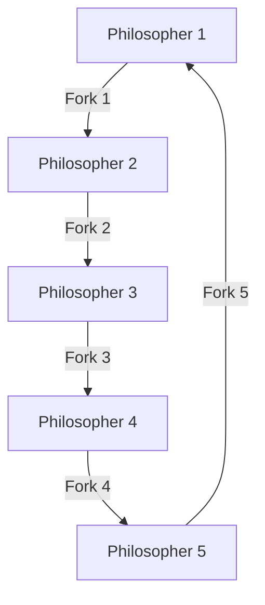

🍴 **42_Philosophers**  
Concurrency philosophers problem in C language.  

## 📜 Table of Contents  
- Introduction  
- How It Works  
- Usage Example  
- Installation  

## 📖 Introduction  
This project is an implementation of the classic **Dining Philosophers Problem** in C, using **threads** and **mutexes** for mutual exclusion. The simulation ensures proper synchronization of philosophers to prevent race conditions and guarantees that no philosopher starves.  

## ⚙️ How It Works  
- A number of philosophers (n) alternate between **thinking, eating, and sleeping**.  
- To eat, a philosopher must pick up **two forks** (one on the right and one on the left).  
- Forks are **protected with mutexes** to avoid race conditions.  
- If a philosopher **fails to eat** within a specified time, they **die**, and the simulation ends.  
- Philosophers do not communicate; they only act based on available resources.




The program execution ends when **one philosopher dies** or when they have **eaten a predefined number of times** (if specified in the execution arguments).  

## 🚀 Installation  
```bash
# Clone the repository  
git clone https://github.com/yourusername/philosophers.git  
cd philosophers/philo  

# Compile the project  
make  

# Run the simulation with 5 philosophers  
./philo 5 800 200 200  
```  

## 🎮 Usage Example  

**Case 1:** Simulation with 5 philosophers and no meal limit  
```bash
./philo 5 800 200 200  
```
```
1623 1 has taken a fork  
1623 1 has taken a fork  
1624 1 is eating  
1824 1 is sleeping  
2024 1 is thinking  
```  

**Case 2:** Simulation with 3 philosophers, each must eat at least 2 times  
```bash
./philo 3 800 200 200 2
```
```
0 2 has taken a fork
0 2 has taken a fork
0 2 is eating
200 2 is sleeping
200 1 has taken a fork
200 1 has taken a fork
200 1 is eating
400 1 is sleeping
400 2 is thinking
400 2 has taken a fork
400 2 has taken a fork
400 2 is eating
600 1 is thinking
600 1 has taken a fork
600 1 has taken a fork
600 1 is eating
```  

In both cases, the simulation continues until a philosopher **dies of starvation** or completes the required number of meals.  
