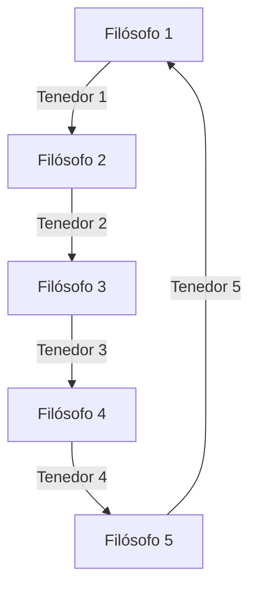

# 🍴 42_Philosophers
Concurrency philosophers problem in C language.
&#x20;&#x20;

## 📜 Índice

- [Introducción](#introducci%C3%B3n)
- [Cómo funciona](#c%C3%B3mo-funciona)
- [Ejemplo de uso](#ejemplo-de-uso)
- [Instalación](#instalaci%C3%B3n)
- [Contacto](#contacto)

## 📖 Introducción

Este proyecto es una implementación del clásico problema de los filósofos comensales en C, utilizando hilos (threads) y exclusión mutua (mutex). La simulación gestiona la sincronización de los filósofos para evitar condiciones de carrera y garantizar que no mueran de hambre.

## ⚙️ Cómo funciona
  -Se crean n filósofos que se alternan entre pensar, comer y dormir.
  -Para comer, cada filósofo necesita tomar dos tenedores (uno a la derecha y otro a la izquierda).
  -Los tenedores están protegidos con mutexes para evitar condiciones de carrera (race conditions).
  -Si un filósofo no logra comer dentro de un tiempo determinado, muere y la simulación termina.
  -Los filósofos no se comunican entre sí, solo toman decisiones basadas en los recursos disponibles.

La ejecución del programa finaliza cuando uno de los filósofos muere o cuando han comido un número predefinido de veces (si se especifica en los argumentos de ejecución).



## 🚀 Instalación  
```sh
# Clonar el repositorio
git clone https://github.com/tuusuario/philosophers.git
cd philosophers/philo

# Compilar el proyecto
make

# Ejecutar la simulación con 5 filósofos
./philo 5 800 200 200
```

## 🎮 Ejemplo de uso  
### Caso 1: Simulación con 5 filósofos y sin límite de comidas
```sh
./philo 5 800 200 200
1623 1 has taken a fork
1623 1 has taken a fork
1624 1 is eating
1824 1 is sleeping
2024 1 is thinking
```

### Caso 2: Simulación con 4 filósofos y cada uno debe comer al menos 3 veces
```sh
./philo 4 800 200 200 3
100 1 has taken a fork
101 1 has taken a fork
102 1 is eating
302 1 is sleeping
502 1 is thinking
```

En ambos casos, la simulación sigue hasta que uno de los filósofos muera de inanición o cumplan el número requerido de comidas.
